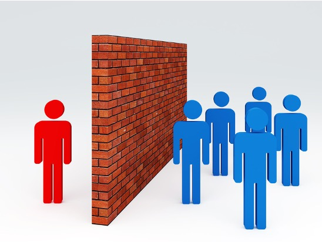

**Background:**
Autistic people often differ from non-autistic people in their style of interaction, which can lead non-autistic people to be reluctant to interact with them (Sasson et al., 2017). This manifestation of stigma can negatively impact mental health and reduce opportunities to form relationships (Slavich et al., 2009). Approximately 44% of autistic young adults enroll in college within eight years of completing high school (Newman et al., 2011), making college an important setting in which to understand the stigmatization of autistic students (e.g., Gillespie-Lynch et al., 2020; Stockwell et al., 2020). A better understanding of which kinds of social activities are most likely to result in stigmatization may be helpful in the development of interventions to reduce the stigmatizing beliefs and behaviors of non-autistic people.

**Objective:**
This study investigated how non-autistic college students’ preferences for interacting with autistic and non-autistic peers differed depending on the hypothetical social activity.

**Method:**
On each of 225 trials, undergraduates selected which of two characters they would prefer to engage in a particular activity with. The characters were described as college students who behaved in ways characteristic of autism (or not) and additionally described as having a special interest (or not). Participants also reported their knowledge of autism and relationships with autistic people. 